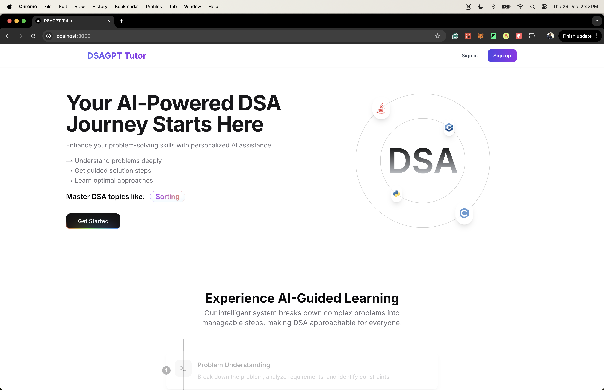
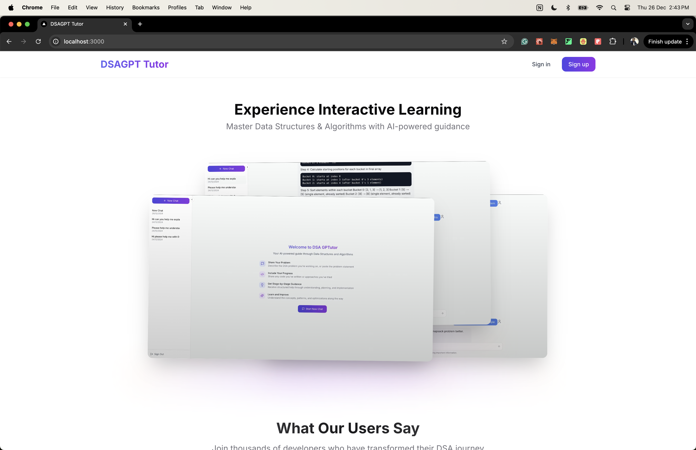
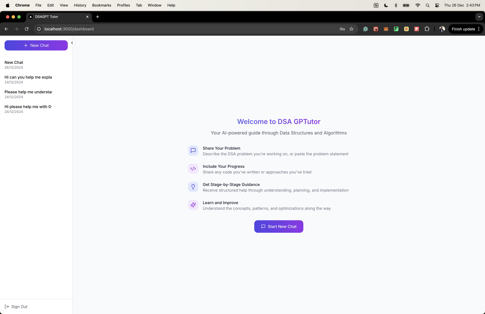
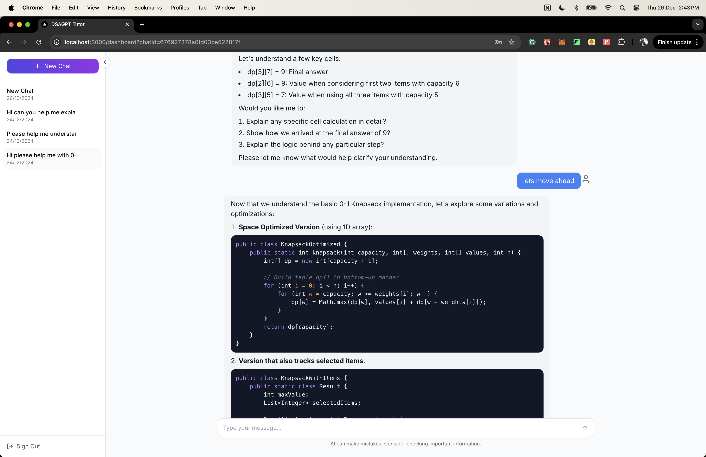

# **DSAGPT Tutor**

DSAGPT Tutor is your personal tutor for mastering Data Structures and Algorithms. It provides step-by-step guidance, similar to learning from a human instructor. With features like AI chat and interactive problem-solving, DSAGPT Tutor helps you excel in your coding interviews.

Built with Next.js and AI technology, this open-source template helps developers create their own programming education tools. As more developers prepare for technical interviews, this template lets you build your own DSA learning platform quickly and easily.

## Features

- User authentication and registration
- AI-powered chatbot for DSA queries
- Interactive problem-solving guidance

## Technologies Used

- Next.js and React for Frontend and Backend
- Database: MongoDB
- AI Integration: Azure OpenAI
- State Management: React Context

## Use Cases
- Integrate with coding platforms to provide real-time code execution and testing.
- Implement a problem repository feature to practice different DSA concepts.
- Create interactive visualization modules for algorithms and data structures.

## Installation Steps

**1. Clone the repository:**

```bash
git clone https://github.com/yashk1998/dsa-buddy.git
cd dsa-buddy
```

**2. Install dependencies:**

```bash
npm install
```

**3. Set up the database:**

Ensure you have [MongoDB](https://www.mongodb.com/) installed and running on your system, or use a cloud-hosted MongoDB service like [MongoDB Atlas](https://www.mongodb.com/products/platform/atlas-database). Create a new Cluster, select a free plan, and copy the connection string, this will be required in the next step.

**4. Set up environment variables:**

Create a `.env.local` file in the root directory and add the following variables:

```
NEXT_PUBLIC_API_URL=http://localhost:3000/api
MONGODB_URI=your_mongodb_connection_string
NEXTAUTH_SECRET=your_nextauth_secret
AZURE_OPENAI_KEY=your_azure_openai_key
AZURE_OPENAI_ENDPOINT=your_azure_openai_endpoint
AZURE_OPENAI_DEPLOYMENT=your_azure_openai_deployment
```

**5. Run the development server:**

```bash
npm run dev
```

**6. Open your browser and navigate to `http://localhost:3000`**

## Screenshots

<div style="float:left; display: flex; flex-wrap: wrap; gap: 10px;">
  
  
  
  
</div>

## How to use the application

1. Register for a new account or log in
2. Explore the chat dashboard
3. Use the chatbot for DSA guidance

## Contributing

We love contributions! Here's how you can help make DSAGPT Tutor even better:

1. Fork the project (`gh repo fork https://github.com/yashk1998/dsa-buddy.git`)
2. Create your feature branch (`git checkout -b feature/AmazingFeature`)
3. Commit your changes (`git commit -m 'Add some AmazingFeature'`)
4. Push to the branch (`git push origin feature/AmazingFeature`)
5. Open a Pull Request

## Contact
Please open an issue in the GitHub repository for any queries or support.
